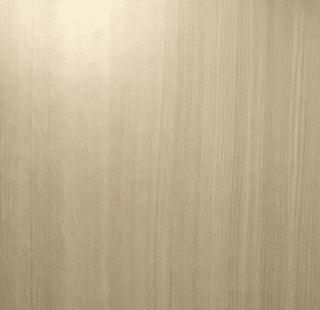

# Talk To The Hand

Video calling over WebRTC with live sign language translation. Try it out here:
* [Talk To the Hand](https://testapp-266201.appspot.com/) - Use Room Name 'delta' and password 'hacks'.

Open this web app on two instances, wait for it to load, then press the call button.

## About
This project was created in 24 hours for DeltaHacks VI.

## How it Works

This web app is hosted on a Flexible App Engine VM instance, which acts as both the content server and the signalling server for WebRTC.
When one caller client calls another, a connection request is passed to the server, which is then directed to the callee client.
Once a connection is established between the two, a P2P connection is set up that securely streams video feed both ways.

On the client side, a TensorFlowJS-based model is then used to provide a live translation whenever it sees any hand signing.
Our model was trained through transfer learning on the stock [MobileNet](https://github.com/tensorflow/tfjs-models/tree/master/mobilenet) model.

### Comments

Unfortunately due to time constraints, we only managed to implement the most essential features to our product.

In the future, we hope to add more changes, like:
* Custom ML model that is more accurate, especially against non-solid backgrounds
* A smaller model for faster loading times (and a loading screen too)
* Custom gesture integration e.g. ASL-style words
* Support for 3-way calling / calling between multiple users

## Built With

* [TensorFlowJS](https://www.tensorflow.org/js/) - For creating ML Models for live sign language translation in the browser
* [Google App Engine](https://cloud.google.com/appengine) - For hosting NodeJS-based signalling server
* [WebRTC](https://webrtc.org/) - For real time P2P connection between clients
* [Socket.io](https://socket.io/) - For allowing continuous websocket-style connection between clients

## Acknowledgments

* Credits to my hackathon team: Ekagra Luthra, Chloe Nguyen, and Arjun Pandher. Hope to work with you guys again soon!
